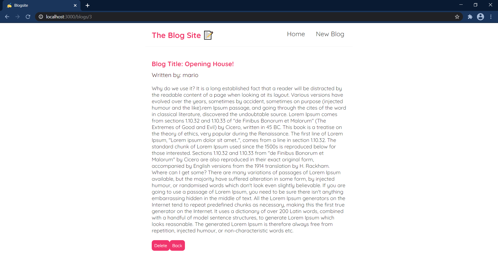
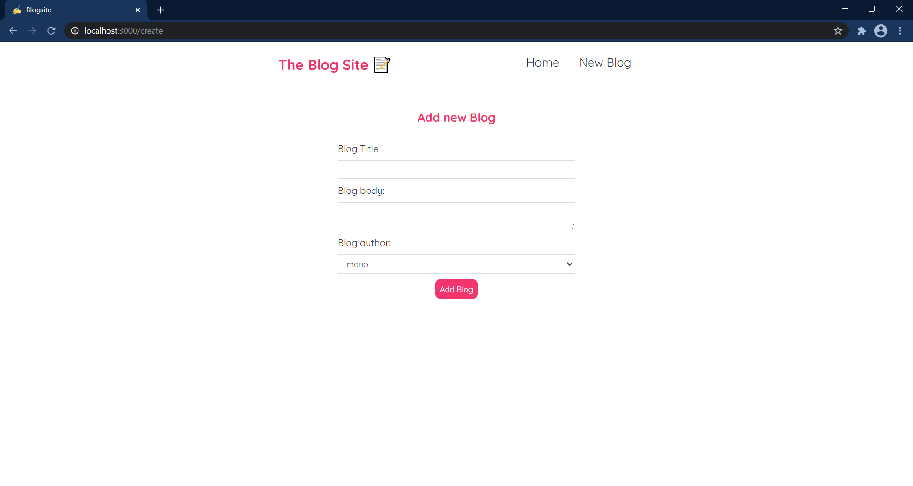

# Blog Site
A simple blog site with CRUD functions built with react and react hooks.
This project was bootstrapped with [Create React App](https://github.com/facebook/create-react-app).

## Functional Dependency
- Users can create a blog using New Blog
- Users can read all the blog in Home
- Users can delete a blog
- Users can now update a blog
- Fetches rest-api and sends the appropriate request to handle the data
- Used json-server to mock rest-api

 
ScreenShots :
-------------

    
    
    
 

 Update:
 -------
 

    
    
    
 

 
 
 

## Available Scripts

In the project directory, you can run:

### `npm start`

Runs the app in the development mode.\
Open [http://localhost:3000](http://localhost:3000) to view it in the browser.

The page will reload if you make edits.\
You will also see any lint errors in the console.

### `npm test`

Launches the test runner in the interactive watch mode.\
See the section about [running tests](https://facebook.github.io/create-react-app/docs/running-tests) for more information.

### `npm run build`

Builds the app for production to the `build` folder.\
It correctly bundles React in production mode and optimizes the build for the best performance.

The build is minified and the filenames include the hashes.\
Your app is ready to be deployed!

See the section about [deployment](https://facebook.github.io/create-react-app/docs/deployment) for more information.

